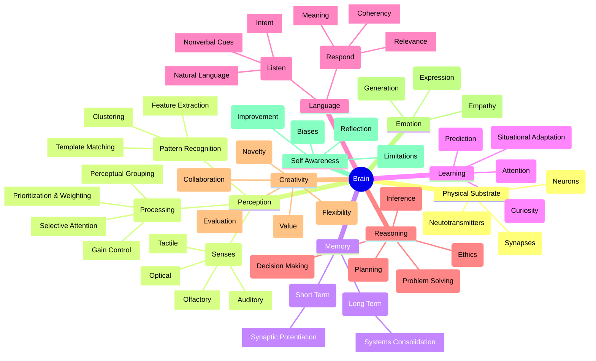

```mermaid
mindmap
    root((Brain))
        Physical Substrate
            (Neurons)
            (Synapses)
            (Neutotransmitters)
        Perception
            (Senses)
                [Optical]
                [Auditory]
                [Tactile]
                [Olfactory]
            (Processing)
                [Selective Attention]
                [Perceptual Grouping]
                [Prioritization & Weighting]
                [Gain Control]
            (Pattern Recognition)
                [Feature Extraction]
                [Clustering]
                [Template Matching]
        Memory
            (Short Term)
                [Synaptic Potentiation]
            (Long Term)
                [Systems Consolidation]
        Learning
            (Prediction)
            (Situational Adaptation)
            (Attention)
            (Curiosity)
        Language
            (Listen)
                [Natural Language]
                [Nonverbal Cues]
                [Intent]
            (Respond)
                [Coherency]
                [Relevance]
                [Meaning]
        Reasoning
            (Problem Solving)
            (Decision Making)
            (Inference)
            (Planning)
            (Ethics)
        Creativity
            (Novelty)
            (Value)
            (Flexibility)
            (Evaluation)
            (Collaboration)
        Emotion
            (Generation)
            (Expression)
            (Empathy)
        Self Awareness
            (Limitations)
            (Biases)
            (Reflection)
            (Improvement)
```